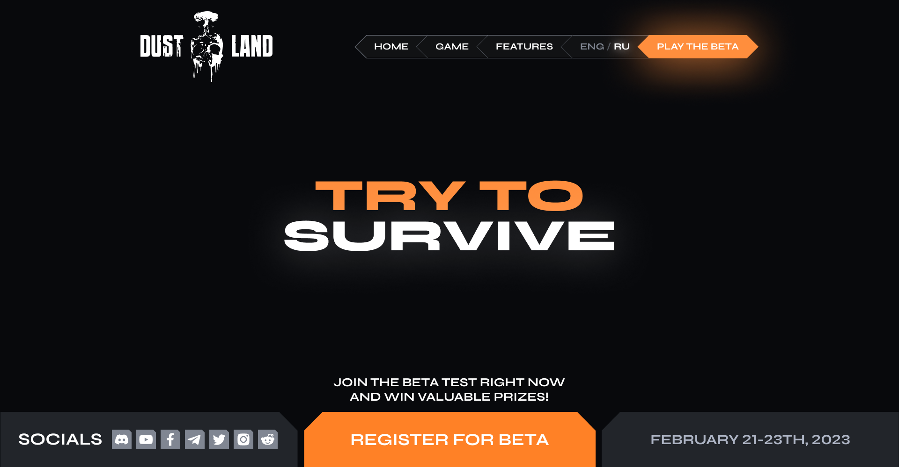

# DustLand Game Landing



- [Дизайн](https://www.figma.com/design/Xnw0OrczQRUks1ENDAAVuv/%D0%BE%D0%BD%D0%BB%D0%B0%D0%B9%D0%BD-%D0%B8%D0%B3%D1%80%D0%B0?node-id=71-35287&t=0cKHPrMGovjPjxFc-1)
- [Демо](https://dmitrywork92.github.io/dustland_landing/)

# DustLand Game — многоформатный шаблон

Этот репозиторий содержит несколько реализаций веб сайта мультиплеер игры **DustLand**, включая:

- Чистый HTML/SCSS/JS-макет
- Тема WordPress

---

## Структура проекта

```bash
dustland_landing/
├── assets/           # Общие стили, скрипты, изображения
├── wp-theme/         # Тема WordPress
├── django-version/   # Приложение Django
└── README.md         # Этот файл
```

---

## Использование

### HTML

Откройте `html-version/index.html` в браузере. Все стили и скрипты включены из `../assets`.

### WordPress

1. Перейдите в `wp-theme/`
2. Скопируйте папку в `wp-content/themes/` вашего сайта WordPress
3. Активируйте тему через панель администратора

## Особенности

- Унифицированная компоновка для разных стеков
- Удобная структура для поддержки
- Быстрое переключение между форматами

## Автор

Разработано dg0st
